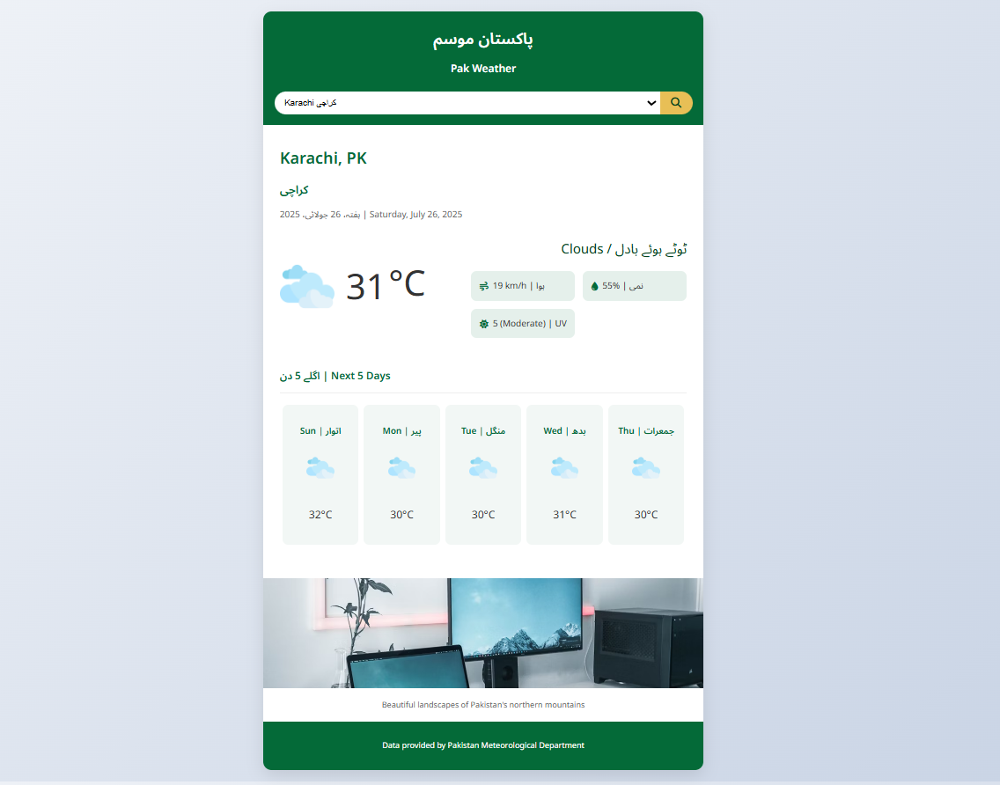

# 🌦️ Pak Weather App

**Pak Weather App** is a real-time weather forecast application specially built for users in Pakistan. It is developed using **HTML**, **CSS**, and **JavaScript**, and it fetches live weather data from an external **Weather API**. The app is bilingual (Urdu + English) and fully responsive across all devices.

## 📌 Key Features

- 🌤️ Real-time weather updates  
- 📆 5-day forecast for each city  
- 📍 Covers almost all major cities of Pakistan  
- 🌐 Bilingual UI (English + Urdu)  
- 📱 Responsive design  
- 🔍 City search functionality  
- 🌬️ Wind speed, ☁️ humidity, 🔆 UV index display  

## 🛠️ Built With

- HTML  
- CSS  
- JavaScript  
- Weather API (OpenWeatherMap)

## 📷 Preview

  

## 🚀 Live Demo

👉 [Click here to try the app](
https://aniqakhan07.github.io/Weather-app/) 
